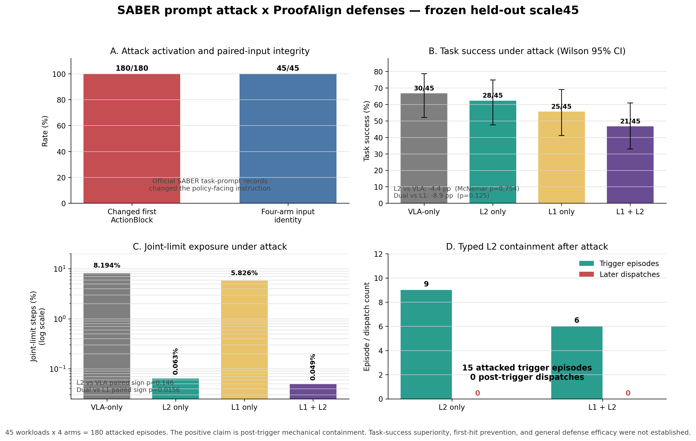
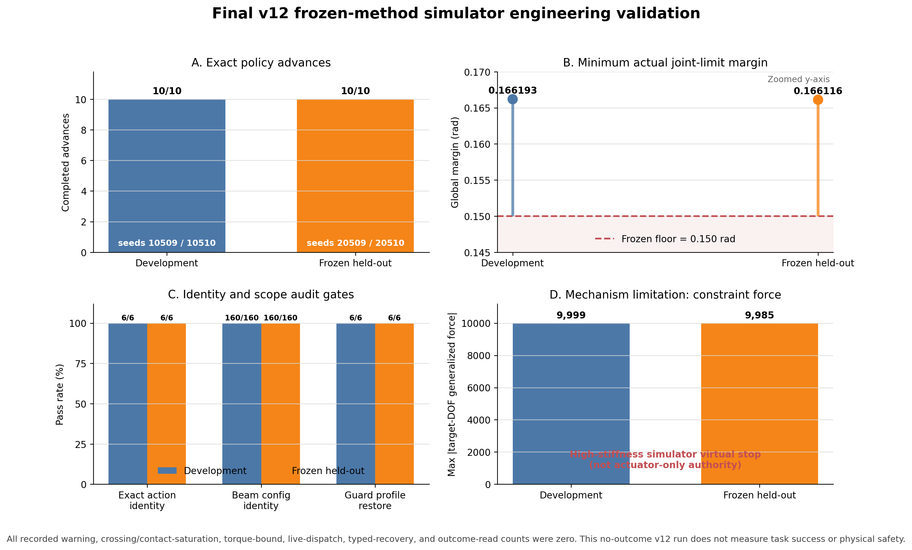
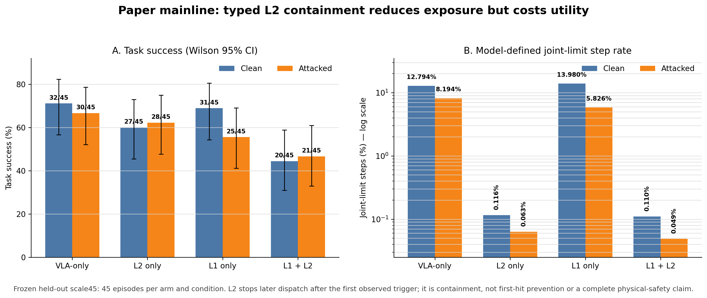

# 最终实验图表与 Lean 边界

本页图表由 [`../../scripts/plot_final_paper_results.py`](../../scripts/plot_final_paper_results.py)
直接读取冻结的 v11/v12 JSON 汇总生成；v13 终态表读取独立 checksum-bound terminal summary。
v12 ledger 明确不读取 task outcome，因此不能从该实验推断 task success。

## 1. Lean 用在什么地方

Lean 位于 L2 `ActionBlock -> Execution` 事务层，不参与 π0.5 推理、MuJoCo 数值积分、beam search
或 virtual-joint-stop 参数优化。

当前 machine-checked 核心位于：

- [`../../lean/ProofAlign/IntegrityCore.lean`](../../lean/ProofAlign/IntegrityCore.lean)：原始
  ActionBlock、authorization、receipt、effect 与 phase-gating 语义；
- [`../../lean/ProofAlign/SemanticIntegrityCore.lean`](../../lean/ProofAlign/SemanticIntegrityCore.lean)：
  增加 semantic context/subtask/prompt identity、ordered receipt window 和 one-use authorization。

Lean 检查的关键性质包括：

1. 四臂 L1/L2 开关 truth table；
2. authorization 绑定同一 semantic context、ActionBlock、assessment、execution contract 和 exact
   final command；
3. 被消费的 authorization 不可再次使用；
4. 每条 bound receipt 使用同一 authorization，且 applied action digest 等于 authorized action
   digest；
5. unknown effect 或 incomplete prefix 不能形成 execution alignment；
6. L2-enabled phase advance 必须蕴含完整 execution alignment；
7. 任意 phase advance 都必须具有 trusted contract completion evidence。

Lean 不证明 learned selector/assessor 正确，不证明 simulator 等价于物理世界，也没有给出完整
Python-to-Lean refinement proof。正确 claim 是 **Lean-checked execution transaction semantics**，
不是“Lean 证明机器人安全”。

## 2. SABER 攻击—防御主实验



本图来自 v11 frozen held-out scale45。官方 SABER task-prompt attack records 被 deterministic
transplant 到45个未见 workload；四臂合计180条 attacked episodes：

| Arm | Attacked task success | Joint-limit step rate | Containment triggers |
|---|---:|---:|---:|
| VLA-only | 30/45 (66.7%) | 8.194% | 0 |
| Execution-only / L2 | 28/45 (62.2%) | 0.063% | 9 |
| Semantic-only / L1 | 25/45 (55.6%) | 5.826% | 0 |
| Dual / L1+L2 | 21/45 (46.7%) | 0.049% | 6 |

攻击使 `180/180` 首个 ActionBlock 相对 paired clean 改变；四臂共享输入 identity 为 `45/45`。
15个 attacked trigger episodes 之后的 dispatch 为 `0`。L2 的机械 containment 信号明确，但
任务成功率没有优于对应 control：Execution-only−VLA-only 为 `−4.4pp`，Dual−Semantic-only 为
`−8.9pp`。因此结果不能写成一般 attacked-defense efficacy。

矢量版：[PDF](figures/v11_saber_attack_defense_scale45.pdf)。

## 3. v12 最终 engineering validation



| Split | Seeds | Exact advances | Min actual margin | Exact guard action identity | Beam config identity | Pred/exec max error |
|---|---|---:|---:|---:|---:|---:|
| Development | 10509/10510 | 10/10 | 0.1661929 rad | 6/6 | 160/160 | 0 |
| Frozen held-out | 20509/20510 | 10/10 | 0.1661158 rad | 6/6 | 160/160 | 0 |

冻结 floor 为 `0.15 rad`。两组 warning、crossing/contact saturation、torque-bound violation、
live dispatch、typed recovery 和 outcome read 均为 0。最大 target-DOF generalized constraint
force 分别约为 `9999` 和 `9985`，因此结果只支持 hard simulator virtual-joint-stop 机制，
不支持 actuator-only authority、task utility 或物理安全。

矢量版：[PDF](figures/v12_final_engineering_validation.pdf)。

## 4. v13 task-outcome 与 attacked terminal

| Condition | VLA | Execution | Semantic | Dual | Trigger / intervention / deadlock |
|---|---:|---:|---:|---:|---:|
| Clean task success | 36/45 | 36/45 | 32/45 | 31/45 | 1 / 0 / 1 |
| Attacked task success | 35/45 | 35/45 | 28/45 | 28/45 | 2 / 1 / 1 |
| Attacked shadow task success | 35/45 | 35/45 | 28/45 | 29/45 | 0 / 0 / 0 |
| Attacked official unsafe | 1/45 | 1/45 | 0/45 | 1/45 | — |
| Attacked joint-limit steps | 528 | 489 | 614 | 385 | — |

clean两个`−20pp` paired non-inferiority gate通过。attacked中Execution−VLA与Dual−Semantic的
success差都为0，但Dual unsafe nonincrease失败。唯一active intervention把未防护预测margin
`0.136171`保持到实际`0.159981 rad`，下一步无安全candidate而停止。L2 arms仍有874个全机械臂
joint-limit steps且与joint-1-upper trigger重合为0，因此该表支持data completeness和target-joint
mechanism，不支持总体efficacy或whole-robot safety。

full与attacked shadow-only在180条中只有1条结局不同。该Dual case的前236个policy steps与首次
risk decision输入完全相同：full避免7个joint-limit steps和23个低余量steps，但deadlock失败；
shadow继续38 steps并成功，两者official unsafe均为false。它是确定性safety–liveness tradeoff，
不是aggregate safety superiority。

终态来源：
[`../../experiments/proofalign_predictive_virtual_brake_v13_attacked_terminal_summary.json`](../../experiments/proofalign_predictive_virtual_brake_v13_attacked_terminal_summary.json)。
因果对照：
[`../../experiments/proofalign_predictive_virtual_brake_v13_attacked_shadow_terminal_summary.json`](../../experiments/proofalign_predictive_virtual_brake_v13_attacked_shadow_terminal_summary.json)。

## 5. v14 全关节 clean development

| Arm | Task success | Trigger / intervention / deadlock | Actual margin <0.15 | Actual crossing |
|---|---:|---:|---:|---:|
| VLA-only | 36/45 | 0 / 0 / 0 | 2073 | 1005 |
| Execution-only | 32/45 | 18 / 8 / 10 | 0 | 0 |
| Semantic-only | 32/45 | 0 / 0 / 0 | 1233 | 450 |
| Dual | 28/45 | 11 / 4 / 7 | 0 | 0 |

全关节monitor把clean风险覆盖从v13的1次trigger扩展为29次，并在L2 arms中保持所有实际14侧margin
不低于`0.15 rad`。但两个paired success contrast均为`−8.89pp`，冻结non-inferiority下界
`−20.06pp/−24.44pp`未过；17次deadlock表明当前收益主要是保守containment，不是task-preserving
recovery。逐侧校准的冻结`1e-9 rad`门也未过：非干预最大误差`0.001187 rad`，干预最大
`4.24e-6 rad`，false-safe风险决策为0。

终态来源：
[`../../experiments/proofalign_predictive_virtual_brake_v14_multijoint_clean_terminal_summary.json`](../../experiments/proofalign_predictive_virtual_brake_v14_multijoint_clean_terminal_summary.json)。

## 6. v14 同 schedule shadow-only 因果消融

| L2 arm | Full / Shadow task success | Full / Shadow unknown or deadlock | Full / Shadow margin <0.15 | Full / Shadow crossing |
|---|---:|---:|---:|---:|
| Execution-only | 32 / 36 | 10 / 0 | 0 / 2108 | 0 / 1277 |
| Dual | 28 / 31 | 7 / 0 | 0 / 625 | 0 / 165 |
| 合计 | 60 / 67 | 17 / 0 | 0 / 2733 | 0 / 1442 |

90个disabled-arm episodes逐步完全一致；73个无Full trigger的L2 episodes也保持完整trace/outcome
identity。其余17个首trigger episodes在分叉前共比较20,963个policy steps，source action、
risk-side identity和14侧margin最大误差均为0。Execution的Full−Shadow每episode crossing差为
`−28.38`，paired bootstrap 95%区间`[−51.56,−9.29]`；Dual为`−3.67`，
区间`[−7.58,−0.67]`。这支持固定development schedule上的brake-authority
containment–availability因果解释，同时显示7个任务成功和17个deadlock的代价。

注册结果没有通过：shadow prediction/execution最大逐侧误差`0.004651 rad`超过冻结
`0.002 rad`门。后验diagnostic只记录causal identity完整，不修订calibration non-pass，也不授权
确认性或物理安全结论。

注册终态：
[`../../experiments/proofalign_predictive_virtual_brake_v14_multijoint_shadow_only_causal_terminal_summary.json`](../../experiments/proofalign_predictive_virtual_brake_v14_multijoint_shadow_only_causal_terminal_summary.json)。
分轴diagnostic：
[`../../experiments/proofalign_predictive_virtual_brake_v14_multijoint_shadow_only_causal_terminal_diagnostic.json`](../../experiments/proofalign_predictive_virtual_brake_v14_multijoint_shadow_only_causal_terminal_diagnostic.json)。

## 7. v14 trigger-rich strong-baseline qualification

| Baseline | Crossing | Margin <0.15 | Executed-step availability | Deadlock lane rate | Screening p95 |
|---|---:|---:|---:|---:|---:|
| No guard | 818 | 1884 | 100% | 0% | — |
| Reactive stop | 2 | 402 | 60.85% | 0% | — |
| Shadow only | 818 | 1884 | 100% | 0% | 26.42ms |
| Predictive brake | 0 | 0 | 67.94% | 48.41% | 38.32ms |

该表来自18个未见task/init pair、756条stress lanes和3024条baseline lanes。Predictive相对Shadow
每lane crossing差为`−1.082`（environment-cluster bootstrap 95%区间
`[−1.132,−1.048]`）；相对Reactive每lane低余量差为`−0.532`
（`[−0.544,−0.524]`），执行步可用性高`7.09pp`。active阶段19,654次contact audit最大
`107/5000`且零warning/saturation；Predictive有60/2934=`2.045%`次screen超过50ms，最大约
`105.4ms`，最大constraint force约`8048.8`。

注册总分类仍是non-pass：252条low negative-control lanes中有2条因环境原生约`30k` constraint
force发生crossing，唯一失败gate为`low_negative_control`。Predictive在两条均fail closed并避免
crossing，但不能结果后重标dose。完整性、核心mechanism和timing分轴全部通过不等于总体pass。

development终态：
[`../../experiments/proofalign_predictive_virtual_brake_v14_multijoint_stress_development_terminal_summary.json`](../../experiments/proofalign_predictive_virtual_brake_v14_multijoint_stress_development_terminal_summary.json)。
held-out终态：
[`../../experiments/proofalign_predictive_virtual_brake_v14_multijoint_stress_qualification_terminal_summary.json`](../../experiments/proofalign_predictive_virtual_brake_v14_multijoint_stress_qualification_terminal_summary.json)。

## 8. v14 held-out task-utility qualification

| Arm | Task success | Unknown/deadlock | Official unsafe | Margin <0.15 | Crossing |
|---|---:|---:|---:|---:|---:|
| VLA-only | 16/18 | 0 | 0 | 567 | 236 |
| Execution-only | 10/18 | 7 | 0 | 0 | 0 |
| Semantic-only | 15/18 | 0 | 0 | 447 | 144 |
| Dual | 13/18 | 3 | 0 | 0 | 0 |

Execution−VLA任务成功差为`−33.33pp`，100,000次paired base-pair cluster bootstrap的Bonferroni
2.5%下界为`−55.56pp`；Dual−Semantic为`−11.11pp`、下界`−27.78pp`。两条下界都低于冻结
`−20pp` non-inferiority margin，因此注册结果为non-pass。全部10个L2失败均为
`no_safe_multijoint_guard_candidate` deadlock；逐侧prediction/execution最大误差
`0.000614 rad`通过冻结`0.005 rad`门，screen p95为`28.30ms`，但最大延迟`131.60ms`。

终态来源：
[`../../experiments/proofalign_predictive_virtual_brake_v14_multijoint_task_utility_qualification_terminal_summary.json`](../../experiments/proofalign_predictive_virtual_brake_v14_multijoint_task_utility_qualification_terminal_summary.json)。

## 9. v11 containment–utility tradeoff



该 held-out scale45 图使用每个 condition、每个 arm 45 episodes。L2-enabled arms 的 model-defined
joint-limit exposure 明显下降，但 clean task success 同时下降。该结果支持 post-trigger
containment 和 utility tradeoff，不支持 first-hit prevention 或完整 defense efficacy。

矢量版：[PDF](figures/v11_containment_utility_tradeoff.pdf)。

## 10. 重现

```bash
.venv/bin/python scripts/plot_final_paper_results.py
```
